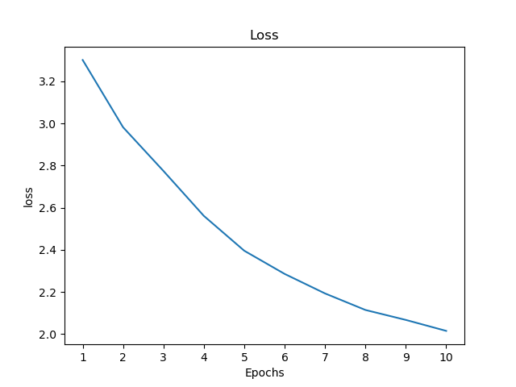
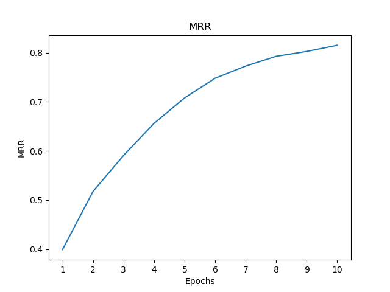
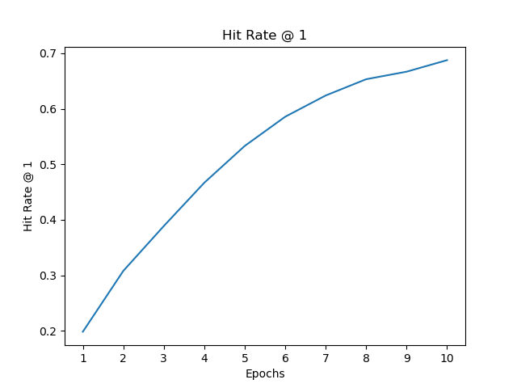

# Visual word sense disambiguation - SemEval 2023

### About
[V-WSD](https://raganato.github.io/vwsd/) is a [SemEval 2023](https://semeval.github.io/SemEval2023/tasks) Task.
<br>Task description : Given a word and some limited textual context, the task is to select among a set of candidate images the one which corresponds to the intended meaning of the target word.
<br>[Dataset](https://drive.google.com/file/d/1byX4wpe1UjyCVyYrT04sW17NnycKAK7N/view?usp=sharing) : The dataset for the task was provided by the organizers of the task. All the target words and their contexts are in the English language for the training data.
Each entry consists of a target word, its context and references to 10 images, all separated by an escape character (tabs). Only one of the corresponding image is the gold standard.

The training set is ~18GB, with 12869 samples. (12999 images are present)
<br>e.g. 
````
target_word <tab> full_phrase <tab> image_1 <tab> image_2 <tab> ... <tab> image_10

"target_word": the potentially ambiguous target word.

"full_phrase": the textual context containing the target_word.
````
### Infrastructure
We used GCP's compute engine for our project. We used a single V100 GPU (16GB VRAM) for our experiments. We cached the 
dataset on GCS to avoid repeated downloads.

### Running the code

The dependencies for running the code can be installed using the [env.yaml](env.yaml) file.
````
conda env create -f env.yaml
conda activate cs521
````
For Training the model, replace the angular braces accordingly for the following command
````
python main.py --base_path "<DATASET_DIR>" --model_save_path "<SAVE_DIR>" --model_log_path "<LOG_DIR>"
````

For Evaluating the model, replace the angular braces accordingly for the following command
````
python main.py --execute 1 --base_path "<DATASET_DIR>" --model_save_path "<SAVE_DIR>" --model_log_path "<LOG_DIR>"
````

### Results
Training Results
1. Loss <br>  <br>
2. Mean Reciprocal Rank <br>  <br>
3. Hit rate @ 1 <br>  <br>
### Future work
Due to the limited access to better hardware we were limited to one experiment, in the future we can
1. Perform hyperparameter search.
2. Investigate data augmentation. Further negative examples could be added to each sample based on the same target word.
3. Apply data augmentation on images such as color jitter, random crop etc.
4. Use more powerful vision encoders. We made use of the tiny variant of ConvNextV2.
### References
1. LiT: Zero-Shot Transfer with Locked-image text Tuning, Xiaohua Zhai, Xiao Wang, Basil Mustafa, Andreas Steiner, Daniel Keysers, Alexander Kolesnikov, Lucas Beyer
